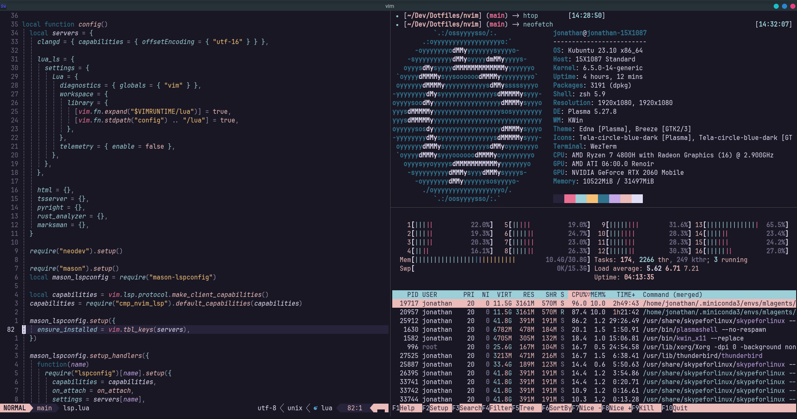
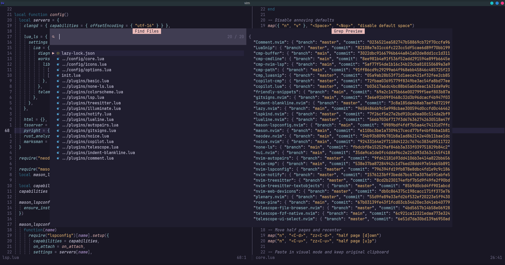
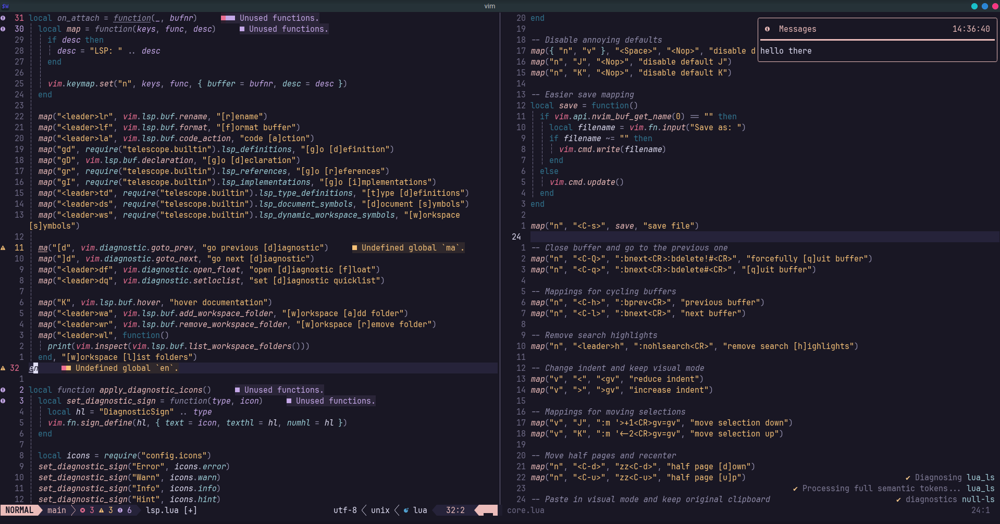

# My Current Neovim Config

## Highlights
 - 100% lua configuration.
 - Modern and organized Lazy based plugin configuration.
 - Telescope is used for all navigation, including buffers.
 - Telescope File Browser is used for file managment (creation, deletion, moving, ...).
 - LSP, formatting and completion is configured with lsp-config, cmp, lua_snip and none-ls manually.
 - Neodev and lua lsp are configured for full completion in the config files.
 - Copilot completion in cmp completion menu.
 - Mason takes care of lsp, linter, formatter, ... managment.
 - Appealing and consistent UI with noice, nui, telescope, lualine, notify, lspkind, devicons, ...
 - Git integration with vim-fugitive and gitsigns.

## Plugins (39)
 - [Comment.nvim](https://github.com/numToStr/Comment.nvim.git)
 - [LuaSnip](https://github.com/L3MON4D3/LuaSnip.git)
 - [cmp-buffer](https://github.com/hrsh7th/cmp-buffer.git)
 - [cmp-cmdline](https://github.com/hrsh7th/cmp-cmdline.git)
 - [cmp-nvim-lsp](https://github.com/hrsh7th/cmp-nvim-lsp.git)
 - [cmp-path](https://github.com/hrsh7th/cmp-path.git)
 - [cmp_luasnip](https://github.com/saadparwaiz1/cmp_luasnip.git)
 - [copilot-cmp](https://github.com/zbirenbaum/copilot-cmp.git)
 - [copilot.lua](https://github.com/zbirenbaum/copilot.lua.git)
 - [friendly-snippets](https://github.com/rafamadriz/friendly-snippets.git)
 - [gitsigns.nvim](https://github.com/lewis6991/gitsigns.nvim.git)
 - [indent-blankline.nvim](https://github.com/lukas-reineke/indent-blankline.nvim.git)
 - [lazy.nvim](https://github.com/folke/lazy.nvim.git)
 - [lspkind.nvim](https://github.com/onsails/lspkind.nvim.git)
 - [lualine.nvim](https://github.com/nvim-lualine/lualine.nvim.git)
 - [mason-lspconfig.nvim](https://github.com/williamboman/mason-lspconfig.nvim.git)
 - [mason.nvim](https://github.com/williamboman/mason.nvim.git)
 - [neodev.nvim](https://github.com/folke/neodev.nvim.git)
 - [noice.nvim](https://github.com/folke/noice.nvim.git)
 - [none-ls](https://github.com/nvimtools/none-ls.nvim.git)
 - [nui.nvim](https://github.com/MunifTanjim/nui.nvim.git)
 - [nvim-autopairs](https://github.com/windwp/nvim-autopairs.git)
 - [nvim-cmp](https://github.com/hrsh7th/nvim-cmp.git)
 - [nvim-lspconfig](https://github.com/neovim/nvim-lspconfig.git)
 - [nvim-notify](https://github.com/rcarriga/nvim-notify.git)
 - [nvim-treesitter-textobjects](https://github.com/nvim-treesitter/nvim-treesitter-textobjects.git)
 - [nvim-treesitter](https://github.com/nvim-treesitter/nvim-treesitter.git)
 - [nvim-web-devicons](https://github.com/nvim-tree/nvim-web-devicons.git)
 - [plenary.nvim](https://github.com/nvim-lua/plenary.nvim.git)
 - [rose-pine](https://github.com/rose-pine/neovim.git)
 - [telescope-file-browser.nvim](https://github.com/nvim-telescope/telescope-file-browser.nvim.git)
 - [telescope-fzf-native.nvim](https://github.com/nvim-telescope/telescope-fzf-native.nvim.git)
 - [telescope-ui-select.nvim](https://github.com/nvim-telescope/telescope-ui-select.nvim.git)
 - [telescope.nvim](https://github.com/nvim-telescope/telescope.nvim.git)
 - [vim-fugitive](https://github.com/tpope/vim-fugitive.git)
 - [vim-illuminate](https://github.com/RRethy/vim-illuminate.git)
 - [vim-rhubarb](https://github.com/tpope/vim-rhubarb.git)
 - [vim-sleuth](https://github.com/tpope/vim-sleuth.git)
 - [which-key.nvim](https://github.com/folke/which-key.nvim.git)
